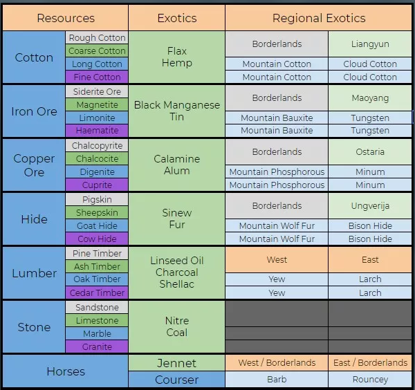

# Resource guide

In this guide we will focus on resources, how they can be claimed and how they can be used.

Resources can be collected in the open world. If you are in a fief you can leave it by 
walking to the Watchman NPC. Click on it and press "Leave Fief". There you can select your units you want to use.

### Recommend resource units {#recommend_resource_units}

We recommend units with the highest Labour. The more Labour you have the more resources you will gather with one run.
You can get the highest (56.00) if you pick 5 Serfs leveled to 7 
and skilled the lowest tree.

 

After you press the "Leave Fief" button a loading screen will appear and you will spawn in the open world in front of your fief.

### Resource fields {#resource_fields}

There are different kinds of resource fields which can be separated in their quality. In the following table you can 
see all existing types of resources and where you can gather them. Also you can get exotic resources and regional exotics.

 
(source: https://elusiveguides.wixsite.com/home/gathering-guide)

### How to gather resources {#gather_resources}

First you have to travel to a resource field. After you reached it you can click on it and then you choose the "Gather" button.
After that a bar appears where you can see the remaining time of gathering.
If it's finished you should see the resources you gathered in your Wagon. If you reached your maximum limit
in your Wagon, the gathered resources will store in the "Resource Piles". From now on you have 2 hours
to collect them. If you don't collect them they will disappear.

If you want to gather from a field you have to pay bronze. You can see in row "Tariff" how much you have to pay per gathering.
If you don't own the fief it could be that you have to pay taxes which can be set by the leading house. You can
use a "Requisition Order" to skip the taxes, and you will pay the "Requisition Tariff".

As you can see in the image above you can gather from this field once. If you claimed a fief in the territorial war 
you can gather 3 times and if some other house of your alliance owns it you can gather twice. If you reached your "Daily Yields Left" you can use a "Requisition Order" to gather more resources.

That's it, after you gathered resources you can use them to craft some unit kits or artillery. You can also
use them for fief quests or just store them. If you are interested in earning silver you can sell the resources on the market. Espacially 
if there are 5-star fief quests you can earn a lot of silver if you check which resource is in great demand. Gather as
much as you can and sell it for the maximum price.

Happy gathering and selling :)